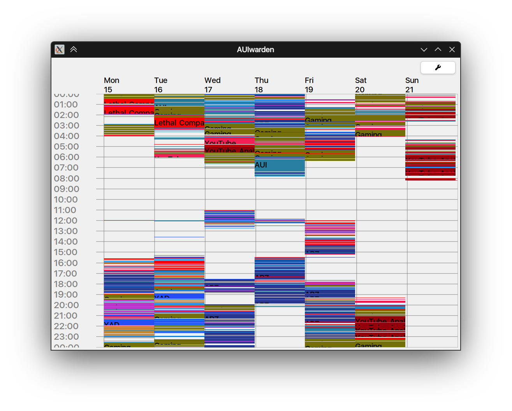

# AUIwarden

**AUIwarden** is a modern, cross-platform desktop application for tracking and visualizing your computer usage, built
with the [AUI](https://github.com/aui-framework/aui) framework.

Self-tracking productivity software. Designed specifically for nerdy weirdos spending their entire day with a single PC.

“A gentle, ever-present companion on your desktop, quietly watching over your computer activity—making sure you know
just how productive (or distracted) you are, without ever being judgmental or invasive.”

## Supported platforms

- **Windows**
- **Linux** (KDE6/Wayland only).

## Features

- Records your computer activity by extracting title bars from windows.
- Tracks when are you AFK.
- Organizes your activities into customizable groups for easy review and filtering.
- Provides visualizations of your week and activity distribution.

## FAQ

### How does the program track activity - automatically or do I need to manually add applications to groups?

**Automatically**. The program tracks activity automatically by constantly monitoring active window titles. It extracts
window titles and records them in the database.

**Grouping happens automatically based on rules** that you can configure. By default, there are pre-configured groups:
- **Web** (Chrome, Firefox, Opera, Vivaldi, Brave, etc.)
- **Gaming** (Dota, Overwatch)
- **Work** (CLion, Visual Studio)

### When does the program tracks activity? Does it work in background?

The program tracks activity when the window is open. When you close it, it would not track activity or create background
services.

If you really want to daily drive this, you'd need to add this program to autostart on your system and keep it
minimized.

### How to properly configure groups (Groups) - what do the fields mean, how to set rules for windows?

Groups are configured through Settings → Grouping. Each group has:

- **Name** - group name (e.g., "Work", "Entertainment")
- **Color** - color for visualization (click for random color)
- **Window Title Contains** - list of window titles that belong to this group

**Configuration rules:**
- Each window title is specified on a new line
- Comparison is case-insensitive
- If a window title contains at least one of the specified strings, it goes into the group
- Example: if you specify "Chrome\nFirefox", windows with titles "Google Chrome" or "Mozilla Firefox" will go into the
  group

### Is it possible to view statistics for past days/weeks?

**Yes**. Click the PIE icon on the left.

### How does the program determine when the user is away from the computer (AFK)? Is the timeout configurable?

**AFK detection:**
- **On Windows**: uses `GetLastInputInfo()` to track the last user input
- **On Linux (Wayland)**: uses the `ext-idle-notify-v1` protocol to detect inactivity

**AFK timeout:**
- **Fixed**: 2 minutes (120 seconds)
- **Configurable in code**: `static constexpr auto TIMEOUT = 2min;` (in `WindowsTracker.cpp` and
    `TrackerWaylandExtIdleNotifyV1.cpp`)
- **Not configurable through GUI**: requires source code modification to change the timeout

### Where is data stored and can it be exported?

**Data storage:**
- **File**: `database.json` in the application directory
- **Format**: JSON, making data readable and editable
- **Structure**: contains `spans` (time intervals) and `groups` (group settings) arrays

**Export:**
- **Direct access**: the `database.json` file can be opened in any text editor
- **JSON format**: allows easy import into other applications or analysis
- **Automatic saving**: data is saved automatically when the application closes

- Data can be manually edited in the JSON file (the data can't be edited through GUI is intentional - don't lie to
  yourself you have spent the entire day working, weirdo, we both know you were playing games)
- You can create backups of the `database.json` file
- Data structure is simple for parsing by other programs

