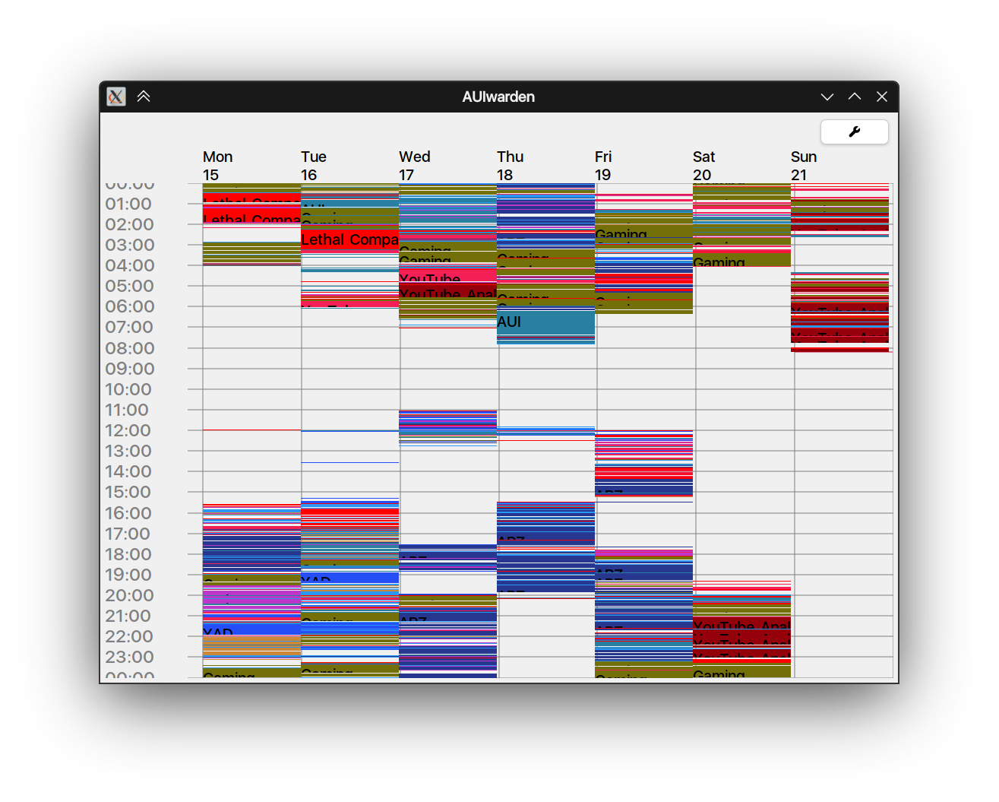

# AUIwarden

**AUIwarden** is a modern, cross-platform desktop application for tracking and visualizing your computer usage, built
with the [AUI](https://github.com/aui-framework/aui) framework.

Self-tracking productivity software. Designed specifically for nerdy weirdos spending their entire day with a single PC,
on KDE6/Wayland.

“A gentle, ever-present companion on your desktop, quietly watching over your computer activity—making sure you know
just how productive (or distracted) you are, without ever being judgmental or invasive.”

## Features

- Records your computer activity by extracting title bars from windows.
- Tracks when are you AFK.
- Organizes your activities into customizable groups for easy review and filtering.
- Provides visualizations of your week and activity distribution.
